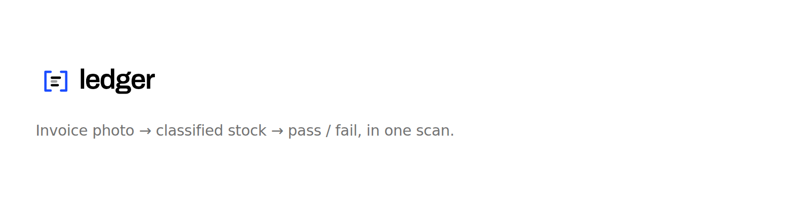

# Ledger brand kit

**Brackets closing on three stock rows.** The brackets bound and verify; the rows
are what was counted.

Two colours: black `#000000` and blue `#1B4DFF` on white `#FFFFFF`.
**Blue is the accent and is used for the brackets only** — the rows stay black
(white on the inverse cuts). Don't introduce a third colour.

If you are an agent working on this repo, start here and with
[`brand.json`](brand.json) — everything you need is in those two files.

## Pick the right file

| Use | File |
|---|---|
| Logo (default) | `brand/logo/ledger-lockup.svg` |
| Logo on a dark background | `brand/logo/ledger-lockup-inverse.svg` |
| Icon only, no wordmark | `brand/logo/ledger-mark.svg` |
| Icon only, on dark | `brand/logo/ledger-mark-inverse.svg` |
| **Loading / scanning state** | `brand/logo/ledger-mark-animated.svg` |
| Animated full logo | `brand/logo/ledger-lockup-animated.svg` |
| Browser tab | `brand/logo/favicon.svg` + `brand/icons/favicon.ico` |
| iOS home screen | `brand/icons/apple-touch-icon-180.png` |
| PWA manifest | `brand/icons/icon-192.png`, `brand/icons/icon-512.png` |
| GitHub org / repo avatar | `brand/social/avatar-512.png` |
| GitHub social preview | `brand/social/social-preview-1280x640.png` |
| Open Graph / link card | `brand/social/og-image-1200x630.png` |
| README banner | `brand/social/readme-banner-1600x400.png` |

## Snippets

Document head:

```html
<link rel="icon" href="/favicon.ico" sizes="any">
<link rel="icon" href="/favicon.svg" type="image/svg+xml">
<link rel="apple-touch-icon" href="/apple-touch-icon-180.png">
<meta property="og:image" content="https://example.com/og-image-1200x630.png">
<meta name="twitter:card" content="summary_large_image">
```

The logo:

```html

```

The animated mark as a scanning / loading state:

```html

```

> **Animation support.** The animated SVGs loop anywhere real CSS runs — Vercel,
> Framer, any browser. They will **not** animate inside a GitHub README, because
> GitHub strips SVG styling. Use a static file there.
>
> If you inline an animated SVG's markup into a page (rather than using ``),
> note that its `<style>` is **not** scoped by the SVG. Every rule is therefore
> namespaced under `.ledger-anim` on the root `<svg>`; keep that class or the
> animation stops, and never strip the namespace — the bare class names (`.row`,
> `.bl`, `.br`) would collide with common page styles and silently collapse the
> host page's own elements.

## Rules

- **Two colours only.** Black `#000000` and blue `#1B4DFF` on white, or the
  inverse files on black. Never add a third colour.
- **Blue is for the brackets only.** Never recolour the rows or the wordmark
  blue, and never render the brackets in anything but `#1B4DFF`.
- **Never distort.** No stretching, skewing, or rotating — scale proportionally.
- **Never restyle.** No gradients, shadows, glows, or outlines. The 38% opacity
  on the middle row is part of the mark, not a styling choice.
- **Never re-typeset the wordmark.** It ships as outlines so it does not depend
  on Archivo being installed.
- **Clear space:** at least one bracket height on every side.
- **Minimum sizes:** 16px using the favicon cut, 32px for the three-row mark,
  120px for the full lockup. Below 32px always use the favicon cut — the three
  rows blur together.

## Regenerating

SVGs are the source of truth; PNGs are derived. **Never hand-edit either** —
change the geometry in `tools/build-brand.py` and rebuild.

```bash
python3 brand/tools/build-brand.py              # everything
python3 brand/tools/build-brand.py --svg-only   # SVGs only
```

PNG output needs headless Chromium and Pillow. Without them the build writes the
SVGs, reports what it skipped, and exits 0.

The wordmark is derived from Archivo SemiBold and committed as
`logo/wordmark.path`, so the normal build never touches the network. Re-run this
only to change the word, weight, or tracking:

```bash
pip install fonttools
python3 brand/tools/extract-wordmark.py
```

Archivo is licensed under the SIL Open Font License.
